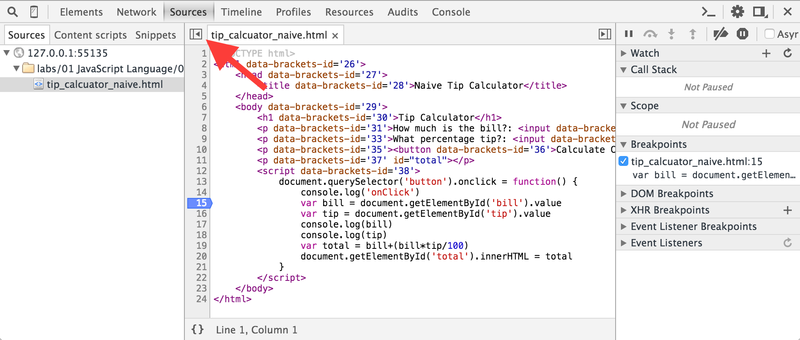
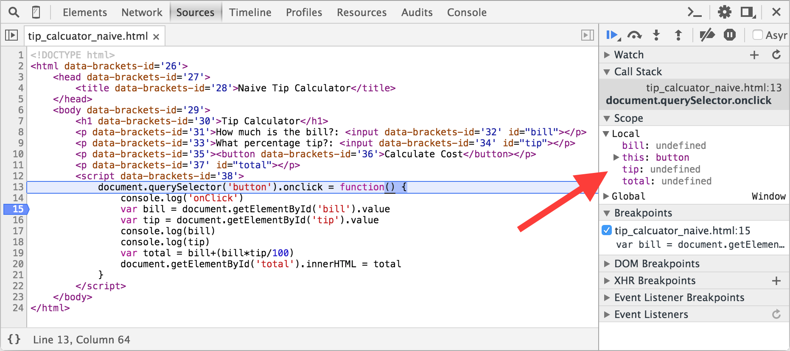
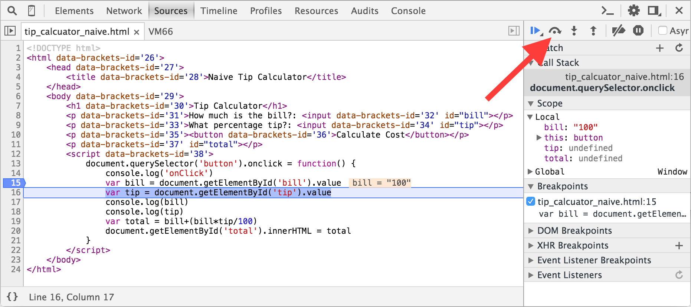

# JavaScript Functions and Objects

This worksheet continues the work started in the **JavaScript Basics** worksheet. You should ensure this has been completed before starting this one.

## Task List
Aim to complete these in roughly 30-60 minutes of lab time.

1. Nest objects to define the internal sub-components of a car and engine.
2. Use an inner “helper function” to calculate fuel consumption.

## 1 Merging 

Over the course of the module there will be changes made to the original read-only repository on GitHub. Luckily Git keeps track of the original repository it was forked from. This is referred to as **upstream/master**. Before you start this worksheet take a few moments to sync your fork which will keep it up to date with the original.
```
git fetch upstream
git checkout master
git merge upstream/master
```
This will pull down any new files or changes from the GitHub repository.

## 2 Basic Debugging

For a much more detailed description read Google’s debugging JavaScript guide.

For simple bugs it is possible to use `console.log()` to print out the values of varlables at key points in the program however it is far more effective to make use of the built-in debugger found in the Chrome Developer Tools.

Start by opening the file `tip_calculator_naive.html` and running it. Try inserting different values into the text boxes and checking the answer. It's clear that something is not quite right!

### 2.1 Using the Debugger

Start by opening the **Chrome Developer Tools** and selecting the **Sources** tab. You should see the html document in the left-hand pane. Click on this to open it. We want to start debugging our code on line 15, where we assign a value to the **bill** variable. Click on the line number to add a breakpoint. This will add the breakpoint to the **Breakpoints** section in the right-hand panel (see below). Now we have selected the file we can close the *navigator* by clicking on the button shown.



Now enter the value 100 for the bill and 10 for the tip. Click on the **Calculate Cost** button. Notice that the main browser window greys out and the first line of the function is highlighted. The highlighted line is the next one to be executed. Also notice that all local variables are listed in the **Debugger** panel.



Now we will see the power of the debugger. Click on the **Step Over** button (shown below) until the program execution is stopped at line 16. Since line 15 assigns a value to the bill variable this now stores a value. Continue to step over the code line by line, checking the contents of all three variables. Once line 20 has executed you will be passed back to the app running in the web browser.



You should make use of the debugger whenever you write JavaScript code. Practice by using it for all the remaining exercises in this worksheet.

### 2.2 Test Your Knowledge

1. Based on the information supplied by the debugger, modify the app to return the correct value (you may need to investigate some additional JavaScript features to be able to do this)
2. What happens if the user enters a non-number in one or both boxes?
3. Modify the app to display a useful message to the user if they enter invalid data

## 3 Exception Handling

Often during the development of apps you will need to respond to **exceptions**, anomalous conditions that need to be handled. JavaScript includes a powerful set of tools to manage exception handling.

Open the file `tip_calculator_better.html` and try to understand the program flow.

1. Use the debugger to watch the execution flow when you enter two numbers.
2. Now run it again but enter blank fields for both, can you see how the program flow changes?

Now compare the code with your solution to the previous example. Notice how the correct use of exception handling makes your code shorter, cleaner and easier to follow. You should make use of this technique in every program you write.

### 3.1 Test Your Knowledge

1. Modify the code so that a warning message is displayed if either field is blank
2. Modify the code so a warning message is displayed if either field contains a non-number

## 3 Nested Sub-Object Assignment

In this task you will extend an existing JS object by nesting further object(s).

1. Open the `function_returns_object.html` file in the editor.
2. View the live preview and hit F12 to view the developer tools JS console.
NOTE: all output from the JS appears on the console.
3. Refresh the browser to see alternative outputs.
4. Review the JS in the html file and ensure you understand how it works.

### 3.1 Test Your Understanding

1. Add a `makeEngine()` function that constructs and returns random engine objects. Engines might be characterised by:
• Cylinders
• CC Volume
• Fuel type (diesel, petrol, etc.)
• Max torque
2. Use the new function inside the `makeCar()` function, to make an engine and add it to the car object returned by `makeCar()`.
3. Ensure you include the engine details in the console log to show that it works.

## 3. Nested Helper Functions

In this task you will modify an existing method of an object and “factor out” some of its code in to a separate internal “helper function” which does an intermediary calculation.
1. Open the object_methods.html file in Brackets.
2. View the live preview and hit F12 to view the developer tools JS console.
NOTE: all output from the JS appears on the console.
3. Review the JS in the html file and ensure you understand how it works.

### 3.1 Test Your Understanding

1. Add an empty internal `updateFuel()` function within the `drive` method of the **fiat** object.
2. Add code to the new helper function which updates the fuel by decrementing the fiat’s fuel by 1.
3. In the original `drive()` method, instead of the assignment `this.fuel = this.fuel - 1`, invoke your new function.
4. Refresh the page and ensure that the console output is exactly the same as before
5. Also test it by adding an appropriate code break in the *Sources* tab of your file in Chrome developer tools, and watch the value of `fiat.fuel` change as you step through the calls to the `fiat.drive()` method.
